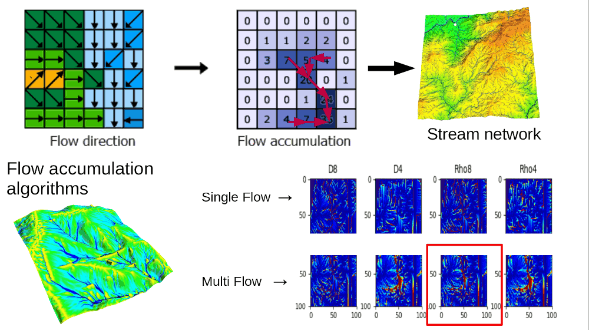

# Geocomputación para aplicaciones ambientales: uso de GDAL y GRASS

Curso online de 5 semanas con explicaciones en español y material en inglés. El curso incluye tres bloques dedicados a GRASS que cubren introducción, hidrología y machine learning.

Programa del curso: <https://spatial-ecology.net/docs/build/html/COURSESAROUNDTHEWORLD/course_geocomp_11-12_2024.html>

## Clase 6: Introducción a GRASS

Configuración del entorno de trabajo, estructura de datos, comandos básicos y scripting en Bash.

Video: <https://youtu.be/XlYLkgCm55A>

Material: <https://spatial-ecology.net/docs/build/html/GRASS/grass_intro.html>

## Clase 7: Análisis hidrológico con GRASS

Extracción de redes de drenaje y delimitación de cuencas a gran escala.

Video: <https://youtu.be/230t0J_H9TY>

Material: <https://spatial-ecology.net/docs/build/html/GRASS/grass_hydro.html>

## Clase 8: Machine Learning con GRASS

Modelado de distribución de especies usando Random Forest con GRASS para preparar predictores ambientales.

Video: <https://youtu.be/P7bJn_Lbj4A>

Material: <https://spatial-ecology.net/docs/build/html/GRASS/SDM1_MWood_gecomp4GRASS.html>

---

Lista completa de videos: <https://www.youtube.com/playlist?list=PL2h1_A_4X7LDPLri1UUA1_5GlRaNfIpE4>

Autor: Giuseppe Amatulli, Yale University / Spatial Ecology

Estos materiales fueron desarrollados como parte del proyecto POSE financiado por la US National Science Foundation (NSF Award 2303651).

{.preview-image}
